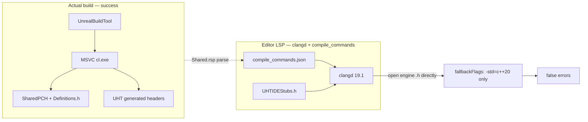
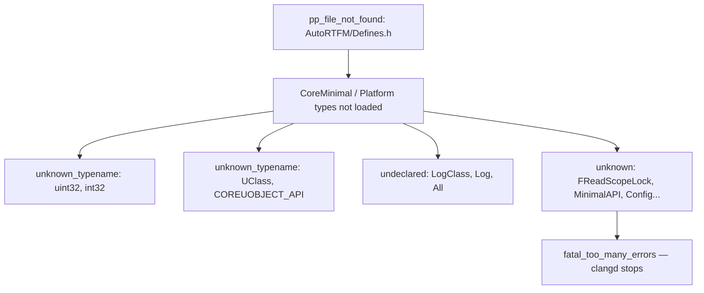
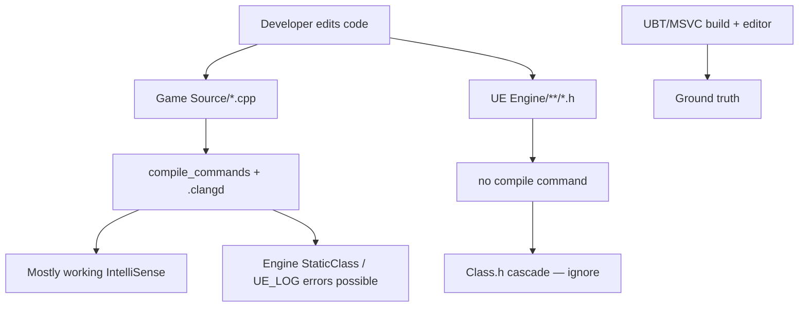

# UE 5.8 clangd Errors vs Actual Build — Structured Analysis

Documentation of **clangd IntelliSense false positives** and **MSVC (UBT) build** mismatches observed during the UE5_8 Cursor experiment.

---

## 1. One-line conclusion

**Build (MSVC + UBT + UHT) and IDE analysis (clangd + `compile_commands.json`) are different pipelines.** Problems panel entries with `source: clang` and severity 8 are often **IntelliSense false positives**, not proof that your game source is wrong—clangd cannot fully reproduce the UE 5.8 compile environment.

---

## 2. Separate diagnostic sources

The IDE Problems view mixes **different origins**:

| Kind | owner / source | Severity | Meaning | Action? |
|------|----------------|----------|---------|---------|
| **IDE IntelliSense** | `_generated_diagnostic_collection_name_#5` / `clang` | 8 (Error) | clangd static analysis failure | **Unrelated to build** — subject of this doc |
| **Real compiler** | `msCompile` / `cpp` | 4 (Warning) | MSVC C4996 while compiling engine headers | Epic internal deprecated APIs — **not your game code** |
| **clangd hint** | `clangd` / `unused-includes` | 4 | include-cleaner suggestion | Optional cleanup |

**msCompile C4996** (`GetAssetRegistryTags`, `ActivateTrackingPropertyValueFlag`, etc.) comes from engine `Class.h` internals. It does not contradict a successful game module build and editor run.

---

## 3. Architecture: why build succeeds but IDE breaks



### Why MSVC build succeeds

- UBT force-includes per-module **PCH** (`SharedPCH.UnrealEd.Project...Cpp20.h`) and **`Definitions.<Module>.h`**
- UHT generates **`*.generated.h`** reflection code
- `.Shared.rsp` records hundreds of `-I` paths including `AutoRTFM/Public`
- `uint32`, `COREUOBJECT_API`, `UClass` come from UE Core headers and macros

### Why clangd fails (three layers)

#### Layer A — “orphan headers” (direct cause of engine `Class.h` errors)

- `Engine/.../UObject/Class.h` line 9: `#include "AutoRTFM/Defines.h"`
- File exists at `Engine/Source/Runtime/AutoRTFM/Public/AutoRTFM/Defines.h`
- Game project `compile_commands.json` **can** include `-I ".../AutoRTFM/Public"` (Ready state from `.Shared.rsp`)
- Opening **engine** `Class.h` in its install path does **not** attach a `.cpp` compile command
- `clangd.fallbackFlags` is **`-std=c++20` only** — no include paths
- `.clangd` lives under the **game project root**; clangd walks upward from the file — headers under `Program Files/Epic Games/...` get **no project config**

#### Layer B — cascade parse failure (follow-on `Class.h` errors)



- One failed include **collapses the whole translation unit**
- `uint32` vs `uint32_t` hints mean clangd only saw **standard `<stdint.h>`**, not UE typedefs

#### Layer C — UObject / UHT limits (game module `.cpp` and `StaticClass`)

- Example: `UStaticMesh::StaticClass()` — MSVC/UHT provides it via `StaticMesh.generated.h`
- `compile_commands` may include `-include SharedPCH...h`, `-include Definitions.<Module>.h`, Engine UHT `-I`
- **SharedPCH is an MSVC precompiled header** — clang **does not fully consume** MSVC PCH via `-include`
- [UHTIDEStubs.h](../templates/UHTIDEStubs.h) stubs **UHT macros** for clangd; v4 also redefines `DECLARE_CLASS2` with IDE-only `StaticClass()` bodies (not used by UBT).
- F12 navigating to the stub file is handled by `ue58rider.goToDefinition`, which filters stub paths and prefers paired `.h`/`.cpp` and project `*.generated.h` for `StaticClass()`.
- [uobject-lsp-research.md](uobject-lsp-research.md): clangd does not run UHT — no Rider-level UObject semantics

---

## 4. Error mapping table

| Error | Typical location | Root cause | Game code bug? |
|-------|------------------|------------|----------------|
| `pp_file_not_found: AutoRTFM/Defines.h` | Engine `Class.h` | No compile DB / fallback on orphan header | **No** |
| `unknown_typename: uint32, int32` | Engine `Class.h` | Core/Platform chain not loaded (cascade) | **No** |
| `unknown_typename: UClass, COREUOBJECT_API` | Engine `Class.h` | CoreUObject macros not loaded (cascade) | **No** |
| `undeclared: LogClass, Log, All` | Engine `Class.h` | UE logging macros (cascade) | **No** |
| `unknown: MinimalAPI, Config, Abstract` | Engine `Class.h` | UCLASS/USTRUCT macro cascade | **No** |
| `fatal_too_many_errors` | Engine `Class.h` | Error cap hit | **No** |
| `no_member: StaticClass in UStaticMesh` | Game module `.cpp` | clangd cannot fully replay engine UHT + MSVC PCH | **No** |
| `UCFS_FChecker` undeclared | Game module `.cpp` | `UE_LOG` / checker macros + PCH approximation | **No** |
| `GetNameSafe` overload failure | Game module `.cpp` | Same as above | **No** |
| `unused-includes` | Game module `.cpp` | include-cleaner heuristic | **No** (optional) |
| `C4996` deprecated API | Engine `Class.h` | Epic engine internal warning | **No** |

---

## 5. Why `.clangd` suppression does not fix engine `Class.h`

[clangdConfig.ts](../src/cursor/clangdConfig.ts) suppresses `pp_file_not_found`, `unknown_typename`, etc., but:

- Suppression applies only to TUs covered by that `.clangd`
- Engine `Class.h` under the install path is **outside** the game project `.clangd` tree
- `no_member_suggest` is not suppressed — game `.cpp` files may still show those errors

---

## 6. Why errors remain when IntelliSense is Ready

With **Ready** `compile_commands.json` from `.Shared.rsp` (AutoRTFM, SharedPCH, Definitions, UHT `-I`):

- Some clangd errors **still remain** due to structural UE + clangd limits
- **Bad config is not the only cause** — same flags can yield different clangd results per file/pattern

---

## 7. Recommended actions

### Workspace / habits

1. Open the **game `.uproject` root** as the Cursor workspace (opening only the extension dev repo breaks `.clangd` / compile DB wiring)
2. **Engine `Class.h` tabs** — red squiggles after Go to Definition are expected clangd limits
3. Trust **`msCompile` errors (severity 8)** only for build failures

### Refresh IntelliSense

- After editor build: **Refresh IntelliSense** → `clangd: Restart language server`
- Confirm status bar `IntelliSense: Ready`

---

## 8. (Optional) Extension mitigation ideas

| Change | Target | Expected effect |
|--------|--------|-----------------|
| Strip/replace MSVC SharedPCH `-include` in `compile_commands` | [compileDatabaseFromRsp.ts](../src/cursor/compileDatabaseFromRsp.ts) | Possible TU / `StaticClass` improvement (needs experiment) |
| Add Core/AutoRTFM **minimal engine `-I` fallback** to `.clangd` | [clangdConfig.ts](../src/cursor/clangdConfig.ts) | Ease `Class.h` cascade when opening engine headers |
| Suppress `no_member` / `fatal_too_many_errors` | clangdConfig.ts | Less noise (not a real fix) |
| Orphan-header UI hint | extension UI | Less user confusion |

Experiment shutdown rationale: suppress + fallback alone **cannot reach Rider-level fidelity**. That is a **UE (MSVC/UHT/PCH) vs generic clangd** gap — not a Cursor or VS Code defect. Teams that need full UObject/reflection IDE often **also** use **JetBrains Rider** or **Visual Studio** alongside Cursor.

---

## 9. Summary diagram



---

## 10. Empirical verification (`clangd --check`)

**Method:** UE5_8 Cursor bundled `clangd 19.1`, run `clangd --check=<relative-path>` from the game project root — same engine as Cursor IDE.

### 10.1 Same compile flags, different clangd outcomes

Multiple game module `.cpp` files share the **same compile command flags**, yet:

- Some modules: **0 errors**
- Some modules: **many errors**

→ Not missing per-file config — **clangd parsing and code pattern differences**.

### 10.2 `Class.h` — 1:1 match with Problems JSON

```
[pp_file_not_found] Line 9: 'AutoRTFM/Defines.h' file not found
[unknown_typename_suggest] Line 122: unknown type name 'uint32'
[unknown_typename] Line 124: unknown type name 'UClass'
...
```

### 10.3 Game module sampling patterns (generalized)

| Category | clangd | Typical pattern | MSVC build |
|----------|--------|-----------------|------------|
| Engine `Class.h` alone | Many errors | AutoRTFM → uint32/UClass cascade | N/A |
| Graphics / actor module | Error | `UStaticMesh::StaticClass()` | OK |
| Character module (some) | **0 errors** | Project `UCLASS::StaticClass()` | OK |
| Combat / component module | Many errors | `UCFS_FChecker`, `GetNameSafe`, `UE_LOG` | OK |
| Controller module | Error | `fatal_too_many_errors` | OK |
| Cinematic subsystem | Many errors | `IsValid`, `GetComponents`, interface `StaticClass` | OK |
| Camera actor | Error | Engine component private member | OK (MSVC PCH) |
| Audio subsystem | Many errors | `GetNameSafe`, `UCFS_FChecker` | OK |

Across **dozens of primary module `.cpp` files** plus plugin sources: **clean and error states mix** — not isolated to one file.

### 10.4 Four error categories

```mermaid
flowchart TD
  subgraph typeA [A: orphan engine header]
    A1[Open Class.h directly]
    A1 --> A2[AutoRTFM include fails]
    A2 --> A3[uint32 UClass cascade]
  end

  subgraph typeB [B: engine UCLASS StaticClass]
    B1["EngineType::StaticClass()"]
    B1 --> B2[generated.h + PCH limits]
  end

  subgraph typeC [C: UE macro / checker]
    C1["UE_LOG + GetNameSafe"]
    C1 --> C2[UCFS_FChecker undeclared]
  end

  subgraph typeD [D: project UCLASS — often OK]
    D1["ProjectType::StaticClass()"]
    D1 --> D2[Intermediate UHT — clangd OK]
  end
```



**Key contrast:** Same compile flags — **project `UCLASS::StaticClass()` often passes**, **engine `UCLASS` fails** — UHT/clangd limit, not a source bug.

### 10.5 Verification conclusions

| Hypothesis | Result |
|------------|--------|
| `Class.h` errors = orphan header without compile DB | **Confirmed** |
| Single `.cpp` is uniquely broken | **Rejected** — reproduced across many modules |
| Bad `compile_commands` config | **Rejected** — Ready, AutoRTFM present, identical flags |
| Build OK + IDE errors coexist | **Confirmed** |
| msCompile C4996 is separate | **Confirmed** |

**Final:** Do **not** treat `source: clang` as build failure. For full UE IntelliSense / UObject semantics, many teams use **Rider or Visual Studio** for that layer; **Cursor remains strong for AI, MCP, and automation** — the split is complementary, not either/or.

---

## Related docs

- [uobject-lsp-research.md](uobject-lsp-research.md)
- [README.md](../README.md)
