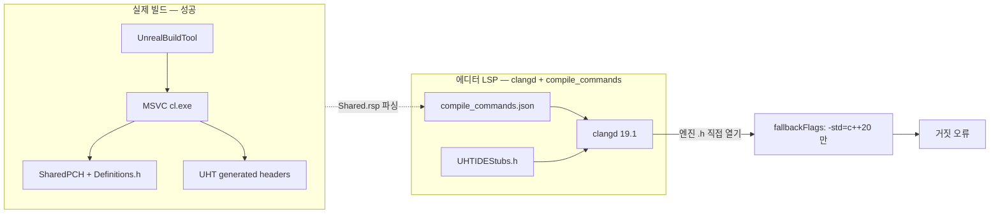
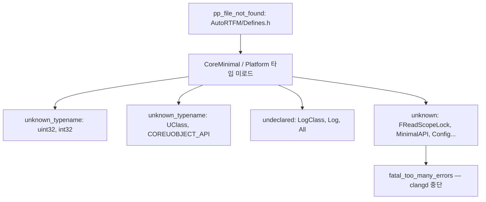
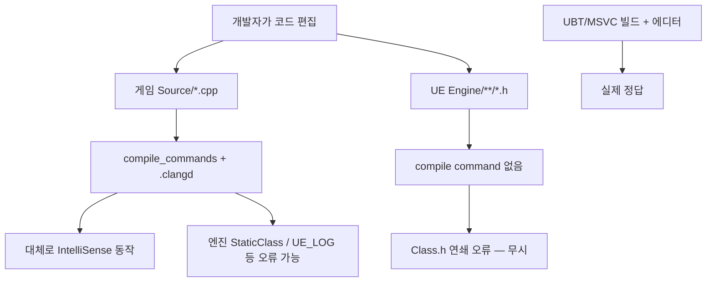
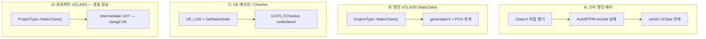

# UE 5.8 clangd 오류 vs 실제 빌드 — 구조화 분석

UE5_8 Cursor 실험에서 관찰한 **clangd IntelliSense 거짓 양성**과 **MSVC(UBT) 빌드** 불일치를 정리한 문서입니다.

---

## 1. 결론 (한 줄)

**빌드(MSVC + UBT + UHT)와 IDE 분석(clangd + `compile_commands.json`)은 서로 다른 파이프라인**입니다. Problems 패널의 `source: clang`, severity 8 오류는 **게임 소스가 틀렸다는 신호가 아니라**, clangd가 UE 5.8 환경을 완전히 재현하지 못할 때 나는 **IntelliSense 거짓 양성**인 경우가 많습니다.

---

## 2. 진단 출처 분리

IDE Problems에는 **서로 다른 출처**의 진단이 섞입니다.

| 구분 | owner / source | 심각도 | 의미 | 조치 필요? |
|------|----------------|--------|------|-----------|
| **IDE IntelliSense** | `_generated_diagnostic_collection_name_#5` / `clang` | 8 (Error) | clangd 정적 분석 실패 | **빌드와 무관** — 본 문서 분석 대상 |
| **실제 컴파일러** | `msCompile` / `cpp` | 4 (Warning) | MSVC가 UE 엔진 헤더 컴파일 시 C4996 | Epic 내부 deprecated API — **프로젝트 코드 문제 아님** |
| **clangd 힌트** | `clangd` / `unused-includes` | 4 | include-cleaner 제안 | 선택적 정리 |

**msCompile C4996** (`GetAssetRegistryTags`, `ActivateTrackingPropertyValueFlag` 등)은 엔진 `Class.h` **내부** 경고이며, 게임 모듈이 정상 빌드·실행되는 것과 모순되지 않습니다.

---

## 3. 아키텍처: 왜 빌드는 되고 IDE는 깨지나



### MSVC 빌드가 성공하는 이유

- UBT가 모듈별 **PCH** (`SharedPCH.UnrealEd.Project...Cpp20.h`)와 **`Definitions.<Module>.h`** 를 force-include
- UHT가 `*.generated.h` 등 **리플렉션 코드** 생성
- `AutoRTFM/Public` 등 수백 개 `-I` 경로를 `.Shared.rsp`에 기록
- `uint32`, `COREUOBJECT_API`, `UClass` 등은 UE Core 헤더 + 매크로로 정의

### clangd가 실패하는 이유 (3가지 층)

#### 층 A — “고아 헤더” (엔진 `Class.h` 오류의 직접 원인)

- `Engine/Source/Runtime/CoreUObject/Public/UObject/Class.h` 9행: `#include "AutoRTFM/Defines.h"` 필요
- 실제 파일: `Engine/Source/Runtime/AutoRTFM/Public/AutoRTFM/Defines.h` (엔진에 존재)
- 게임 프로젝트의 `compile_commands.json`에는 `-I ".../AutoRTFM/Public"` **포함될 수 있음** (`.Shared.rsp` 기반 Ready 상태)
- **엔진 설치 경로의 Class.h를 탭으로 직접 열면** 해당 `.cpp`의 compile command가 적용되지 않음
- `.vscode/settings.json`의 `clangd.fallbackFlags`는 **`-std=c++20`만** → include 경로 없음
- `.clangd`는 **게임 프로젝트 루트**에만 있고, clangd는 파일 위치에서 상위로 `.clangd` 탐색 → `Program Files/Epic Games/...` 아래 엔진 헤더에는 **프로젝트 설정 미적용**

#### 층 B — 연쇄 파싱 붕괴 (Class.h 후속 오류)



- 첫 include 실패 하나가 **전체 translation unit 파싱을 무너뜨림**
- `uint32` vs `uint32_t` 제안은 clangd가 **표준 `<stdint.h>`만 본 상태** — UE typedef 미인식

#### 층 C — UObject / UHT 한계 (게임 모듈 `.cpp`의 `StaticClass`)

- 예: `UStaticMesh::StaticClass()` — MSVC/UHT는 `StaticMesh.generated.h` 통해 제공
- `compile_commands`에 `-include SharedPCH...h`, `-include Definitions.<Module>.h`, Engine UHT `-I` 포함 가능
- **SharedPCH는 MSVC precompiled header** — clangd `-include`로 넣어도 **clang ↔ MSVC PCH 형식 불일치**
- [UHTIDEStubs.h](../templates/UHTIDEStubs.h)는 `UCLASS`/`GENERATED_BODY` **매크로 스텁만** — 엔진 클래스 `StaticClass()` 본문 없음
- [uobject-lsp-research.md](uobject-lsp-research.md): clangd는 UHT 미실행 → Rider 수준 UObject 분석 불가

---

## 4. 오류별 매핑표

| 오류 | 대표 위치 | 실제 원인 | 게임 코드 문제? |
|------|-----------|-----------|----------------|
| `pp_file_not_found: AutoRTFM/Defines.h` | 엔진 `Class.h` | compile DB / fallback include 미적용 (고아 헤더) | **아니오** |
| `unknown_typename: uint32, int32` | 엔진 `Class.h` | Core/Platform 체인 미로드 (연쇄) | **아니오** |
| `unknown_typename: UClass, COREUOBJECT_API` | 엔진 `Class.h` | CoreUObject 매크로 미로드 (연쇄) | **아니오** |
| `undeclared: LogClass, Log, All` | 엔진 `Class.h` | UE 로깅 매크로 미로드 (연쇄) | **아니오** |
| `unknown: MinimalAPI, Config, Abstract` | 엔진 `Class.h` | UCLASS/USTRUCT 매크로 연쇄 | **아니오** |
| `fatal_too_many_errors` | 엔진 `Class.h` | error cap 도달 | **아니오** |
| `no_member: StaticClass in UStaticMesh` | 게임 모듈 `.cpp` | 엔진 UHT + MSVC PCH를 clangd가 완전 재현 못함 | **아니오** |
| `UCFS_FChecker` undeclared | 게임 모듈 `.cpp` | `UE_LOG` / checker 매크로 + PCH 근사 한계 | **아니오** |
| `GetNameSafe` 오버로드 실패 | 게임 모듈 `.cpp` | 위와 동일 | **아니오** |
| `unused-includes` | 게임 모듈 `.cpp` | include-cleaner 휴리스틱 | **아니오** (무시 가능) |
| `C4996` deprecated API | 엔진 `Class.h` | Epic 엔진 내부 경고 | **아니오** |

---

## 5. `.clangd` suppression이 엔진 Class.h에 안 먹는 이유

[clangdConfig.ts](../src/cursor/clangdConfig.ts)는 `pp_file_not_found`, `unknown_typename` 등을 suppress하지만:

- suppression은 **해당 `.clangd`가 적용되는 TU**에만 유효
- **엔진 설치 경로**의 `Class.h`는 게임 프로젝트 `.clangd` **범위 밖**
- `no_member_suggest` 등은 suppress 목록에 없어 게임 `.cpp`에서 그대로 표시될 수 있음

---

## 6. IntelliSense 설정이 Ready여도 오류가 남는 이유

`.Shared.rsp` 기반 **Ready** `compile_commands.json` (AutoRTFM, SharedPCH, Definitions, UHT `-I` 포함)에서도:

- clangd + UE **구조적 한계**로 일부 error 유지
- **설정 불량 ≠ 유일 원인** — 동일 flags인데 파일·패턴마다 clangd 결과가 다를 수 있음

---

## 7. 권장 조치

### 워크스페이스 / 습관

1. **게임 `.uproject` 루트**를 Cursor 워크스페이스로 열기 (확장 개발 repo만 열면 `.clangd` / compile DB 연결 불안정)
2. **엔진 Class.h 탭** — Go to Definition으로 연 엔진 헤더의 빨간 줄은 clangd 한계로 간주
3. **`msCompile` error (severity 8)** 만 빌드 실패 지표로 사용

### IntelliSense 갱신

- 에디터 빌드 후: **Refresh IntelliSense** → `clangd: Restart language server`
- Status bar `IntelliSense: Ready` 확인

---

## 8. (선택) 확장 측 완화 아이디어

| 개선 | 대상 | 기대 효과 |
|------|------|-----------|
| `compile_commands`에서 MSVC SharedPCH `-include` 제거/대체 | [compileDatabaseFromRsp.ts](../src/cursor/compileDatabaseFromRsp.ts) | TU 파싱·`StaticClass` 일부 개선 (실험 필요) |
| `.clangd` Add에 Core/AutoRTFM **최소 엔진 `-I` fallback** | [clangdConfig.ts](../src/cursor/clangdConfig.ts) | 엔진 헤더 직접 열 때 Class.h 연쇄 완화 |
| `no_member` / `fatal_too_many_errors` suppress | clangdConfig.ts | 노이즈 감소 (근본 해결 아님) |
| 고아 헤더 UI 안내 | extension UI | 사용자 혼란 방지 |

실험 종료 판단: suppress·fallback만으로는 **Rider급 fidelity** 기대 어려움. **Cursor/VS Code 자체 문제가 아니라** UE(MSVC/UHT/PCH)와 범용 clangd 사이 간극. full UObject/리플렉션 IDE가 필요하면 **Rider 또는 Visual Studio**를 함께 쓰는 팀이 많음.

---

## 9. 요약 다이어gram



---

## 10. 실증 검증 (`clangd --check`)

**방법:** UE5_8 Cursor 번들 `clangd 19.1`로 게임 프로젝트 루트에서 `clangd --check=<relative-path>` 실행. Cursor IDE와 동일 엔진.

### 10.1 동일 compile flags, 다른 clangd 결과

여러 게임 모듈 `.cpp`가 **동일 compile command 플래그**를 공유함에도:

- 일부 모듈: **0 error**
- 일부 모듈: **다수 error**

→ 설정 누락이 아니라 **clangd 파싱·코드 패턴 차이**.

### 10.2 Class.h — Problems JSON과 1:1 재현

```
[pp_file_not_found] Line 9: 'AutoRTFM/Defines.h' file not found
[unknown_typename_suggest] Line 122: unknown type name 'uint32'
[unknown_typename] Line 124: unknown type name 'UClass'
...
```

### 10.3 게임 모듈 샘플링 패턴 (파일명 일반화)

| 유형 | clangd | 대표 패턴 | MSVC 빌드 |
|------|--------|-----------|-----------|
| 엔진 `Class.h` 단독 | 다수 error | AutoRTFM → uint32/UClass 연쇄 | N/A |
| 그래픽/액터 모듈 | error | `UStaticMesh::StaticClass()` | 정상 |
| 캐릭터 모듈 (일부) | **0 error** | 프로젝트 `UCLASS::StaticClass()` | 정상 |
| 전투/컴포넌트 모듈 | 다수 error | `UCFS_FChecker`, `GetNameSafe`, `UE_LOG` | 정상 |
| 컨트롤러 모듈 | error | `fatal_too_many_errors` | 정상 |
| 시네마틱 서브시스템 | 다수 error | `IsValid`, `GetComponents`, 인터페이스 `StaticClass` | 정상 |
| 카메라 액터 | error | 엔진 컴포넌트 private 멤버 | 정상 (MSVC PCH) |
| 오디오 서브시스템 | 다수 error | `GetNameSafe`, `UCFS_FChecker` | 정상 |

게임 **Primary 모듈 `.cpp` 수십 개** + 플러그인 `.cpp`에서 **clean / error 혼재** — 특정 한 파일만의 문제 아님.

### 10.4 오류 유형 4분류



**핵심 대조:** 동일 compile flags에서 **프로젝트 UCLASS `StaticClass()`는 종종 통과**, **엔진 UCLASS는 실패** → 소스 버그가 아니라 UHT/clangd 한계.

### 10.5 검증 결론

| 가설 | 결과 |
|------|------|
| Class.h = compile DB 없는 고아 헤더 | **확인** |
| 특정 한 `.cpp`만의 문제 | **기각** — 다수 모듈에서 재현 |
| compile_commands 설정 불량 | **기각** — Ready, AutoRTFM 포함, flags 동일 |
| 빌드 성공 + IDE error 공존 | **확인** |
| msCompile C4996 = 별개 | **확인** |

**최종:** `source: clang` 진단을 **빌드 실패 지표로 쓰면 안 됨**. full UE IntelliSense/UObject 의미 분석이 우선이면 **Rider 또는 Visual Studio**를 쓰는 팀이 많고, **Cursor는 AI·MCP·자동화** 쪽과 잘 맞음 — 상호 배타가 아님.

---

## 관련 문서

- [uobject-lsp-research.md](uobject-lsp-research.md)
- [README.md](../README.md)
